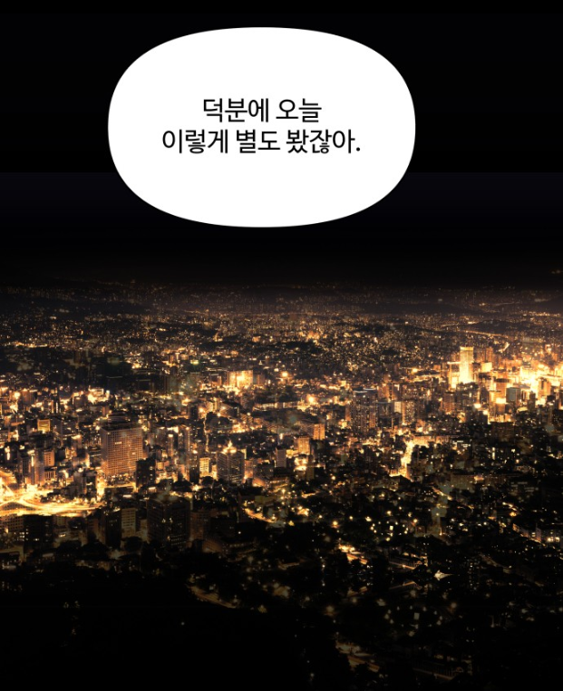

여보세요...?
{:.figcaption}

<iframe width="400" height="210" src="https://www.youtube.com/embed/D9DbzJZJtpo" frameborder="0" allow="accelerometer; autoplay; clipboard-write; encrypted-media; gyroscope; picture-in-picture" allowfullscreen></iframe>

노래를 들으며 마음을 달래자
{:.figcaption}

<strong>새해가 됐지만 정신 연령은 21살에 멈춘 것 같다. 군대에 있어서 그런가...  
장범준 노래를 들으면 항상 21살 여름이 떠올려진다. 친구들하고 대학 축제를 돌아다니고 다 끝나고 집 가는 길이 항상 생각난다.  
그때의 그 분위기하며 풀내음, 공기가 잊혀지지가 않는다    </strong>

> 저 노래를 들으면서 `바른연애길잡이`를 재미있게 보았다.

 

달달하구먼...
{:.figcaption}

## **<U>다들 잘 지내시나요?</U>**

나에게 소중한 사람들은 모두 2021년은 잘 보냈으면 좋겠다. 나는 올해 군대에 12월까지 있어야겠지만 나도 꽤나 재밌게 보냈으면 좋겠다.
