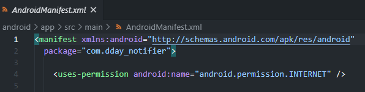

Dday-Notifier
{:.figcaption}

* this unordered seed list will be replaced by the toc
{:toc}

오늘부터 React-Native 로 디데이 앱을 만드는 과정을 포스팅 할 예정이다. 내가 겪은 오류들, 앱을 처음 만들면서 겪는 시행착오들 등등... 디데이 앱 시리즈를 포스팅하면서 다 적을 것이다.
<br><br>

이 앱에 관한 전반적인 설명이 필요할 것 같아 아래에 적어보겠다.

> 이 앱은 자신이 설정한 날짜의 D-Day 를 알려줍니다. 중요한 이벤트까지 며칠이 남았는지, 또는 며칠이 지났는지 파악이 가능하도록 합니다. 데이터베이스는 Firebase Database 를 이용할 것이고, 회원 관리 관련은 Firebase Authentication 을 이용할 예정입니다. 아래는 개략적인 앱 설계도입니다.

![roadmap]
구글 드로잉을 이용하였다.
{:.figcaption}

그림을 보시다시피 **_AppStack_** 과 **_AuthStack_** 이 중요한 역할을 한다. 만약 유저가 유효하다면 **_AppStack_** 이 로딩되고 아니라면 **_AuthStack_** 이 로딩된다.
추후 포스팅에서는 **_AuthStack_** 에 관해 먼저 다루겠다.

## React-Native와 Firebase

![firebase]

**Dday-Notifier** 앱은 로그인, 회원가입, 패스워드 찾기 기능이 가능하다. 따라서 유저를 등록시키고 관리해줄 수 있는 것이 필요했는데 사용한 것이 바로 **_Firebase_** 이다. 
관련 문서는 _[RNfirebase](https://rnfirebase.io/){:target="_blank"}_ 에서 확인 가능하다. 

### Firebase 에 프로젝트 등록하기

우선 **Firebase** 회원가입을 하자. _[FireBase](https://firebase.google.com/){:target="_blank_"}_ <br><br>
![firebasehome]

회원가입 후 Firebase 홈페이지
{:.figcaption}

들어간 후 _Firebase_ 에 자신의 프로젝트를 추가해야한다. **톱니바퀴 → 프로젝트 설정 → 내 앱 → 안드로이드 클릭** 을 해주자.<br>
들어가면 프로젝트 패키지를 입력하라는 칸이 있다. 자신의 프로젝트 패키지를 알려면 **android > app > src > main > AndroidManifest.xml** 을 확인하면 된다. <br>

<div style="text-align:center;"></div><br>

AndroidMenifest.xml
{:.figcaption}

그 다음 디버그 서명 인증서 SHA-1 을 입력해주는 칸이 있다. 이 인증서가 있어야만 구글 로그인, 전화번호를 지원해주므로 웬만하면 적어주도록 하자.<br>
***근데 SHA-1을 어떻게 알아내지??*** <br>

꽤 간단하다. 자신의 프로젝트가 있는 폴더로 들어간다. 그 다음 <br>
```cd android && ./gradlew signingReport```<br>
를 입력해주자. <br><br>

![sha1]<br>

빨간 네모 안에 있는 SHA-1 값
{:.figcaption}

그런 다음 _Firebase_ 에서 시키는대로 하면 자신의 프로젝트 등록이 끝난다. 

### react-native-firebase 패키지 설치

이제 **_React-Native_** 로 만든 앱에 _Firebase_ 를 설치해야한다. <br>

~~~ bash
# Using npm
npm install --save @react-native-firebase/app

# Using Yarn
yarn add @react-native-firebase/app
~~~

여기까지 하면 **_React-Native 프로젝트_** 에 _Firebase_ 를 연동시킬 준비가 완료된다. 다음 포스팅에서는 로그인에 대해 다뤄보도록 하겠다.
[roadmap]: ../../assets/img/blog/roadmap.jpg
[firebase]: https://miro.medium.com/max/1200/1*rm_JpFtoORkBp0TcCOWq2Q.png
[firebasehome]: ../../assets/img/blog/firebasehome.png
[sha1]: ../../assets/img/blog/sha1.png